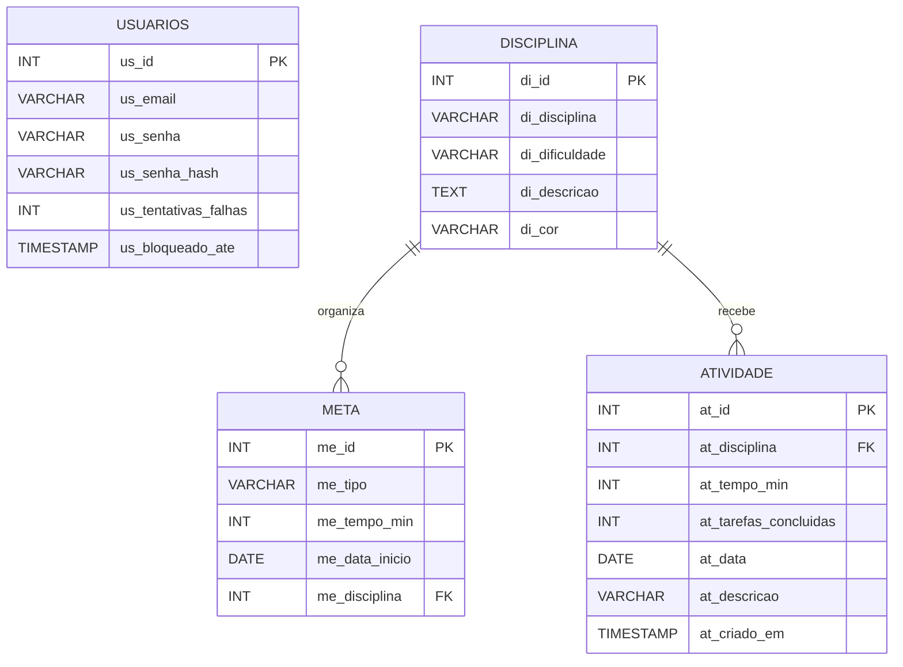
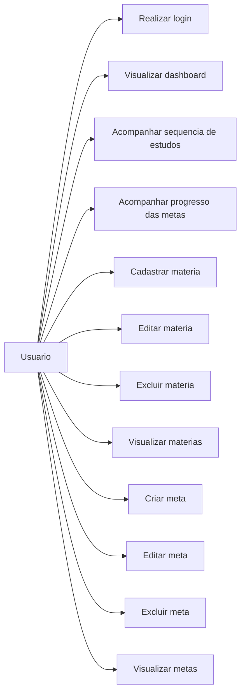
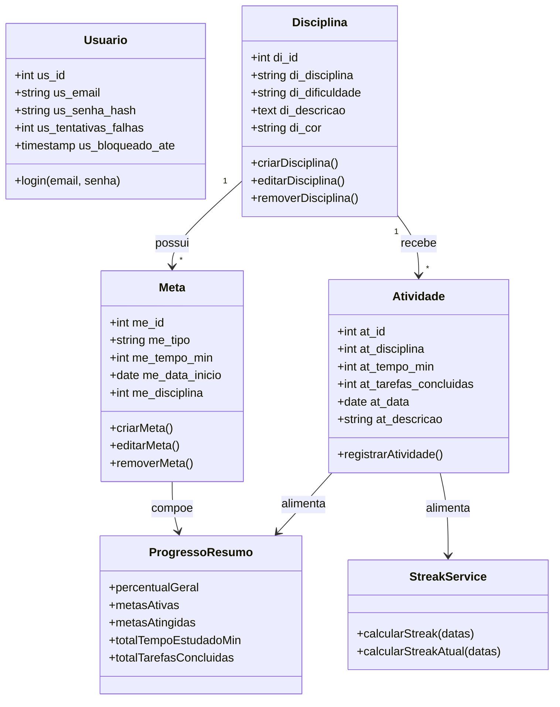

# Artefatos Visuais Atualizados

Este arquivo consolida a leitura e a atualizacao conceitual dos artefatos raster da pasta `docs`:

- `DER.png`
- `Diagrama de caso de Uso.png`
- `Diagrama de Classe.png`
- `Fluxograma N1.jpeg`
- `Fluxograma N2.jpeg`

Os arquivos em imagem permanecem como exportacoes estaticas da documentacao, enquanto este Markdown passa a ser a referencia textual atualizada do sistema.

## 1. DER atualizado

### Leitura

- `disciplina` continua sendo a base organizacional do estudo
- `meta` permanece vinculada a uma disciplina
- `atividade` passa a ser o insumo operacional do dashboard, alimentando `streak` e `progresso`
- `usuarios` participa da autenticacao e da politica de bloqueio de login

## 2. Diagrama de caso de uso atualizado

### Leitura

O caso de uso original foi preservado e ampliado com a visualizacao do dashboard, da sequencia de estudos e do progresso das metas, que agora fazem parte do fluxo real da aplicacao.

## 3. Diagrama de classes atualizado

### Leitura

- A relacao principal `Disciplina -> Meta` foi mantida
- `Atividade` foi adicionada porque hoje ela e necessaria para o comportamento do painel
- `StreakService` representa a regra de negocio de sequencia de estudos
- `ProgressoResumo` representa a consolidacao exibida no dashboard

## 4. Fluxogramas atualizados

Os fluxogramas originalmente exportados em `Fluxograma N1.jpeg` e `Fluxograma N2.jpeg` continuam coerentes com a proposta da Sprint, mas o sistema atual exige complementar a leitura com:

- entrada no dashboard `/app`
- exibicao de `streak`
- exibicao de `progresso`
- dependencia de atividades para alimentar os indicadores

Os fluxos atualizados em formato Mermaid estao documentados em:

- `DIAGRAMAS_TELAS_USUARIO_FINAL.md`

## 5. Estado atual consolidado

Resumo do sistema documentado hoje:

1. O usuario faz login e recebe token JWT
2. O sistema redireciona para `/app`
3. O dashboard mostra sequencia de estudos e progresso das metas
4. O usuario continua gerenciando materias e metas
5. O backend usa atividades para calcular os indicadores exibidos ao usuario
