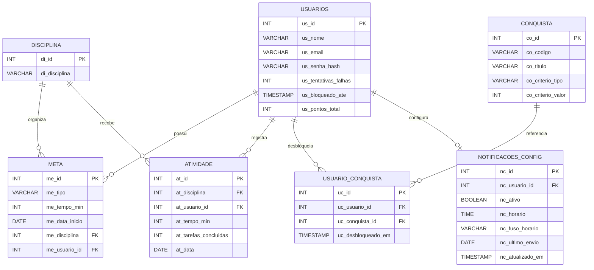

# Artefatos Visuais Atualizados

Este arquivo consolida o estado real do codigo backend apos as historias de:

- conquistas automaticas por usuario
- pontuacao acumulativa por estudo
- notificacoes de lembrete por email

## DER vigente (texto fonte)

## Observacao

As imagens raster (`.png` e `.jpeg`) da pasta `docs` podem permanecer defasadas visualmente. A referencia vigente para arquitetura e regras passa a ser os arquivos Markdown e Mermaid atualizados.
