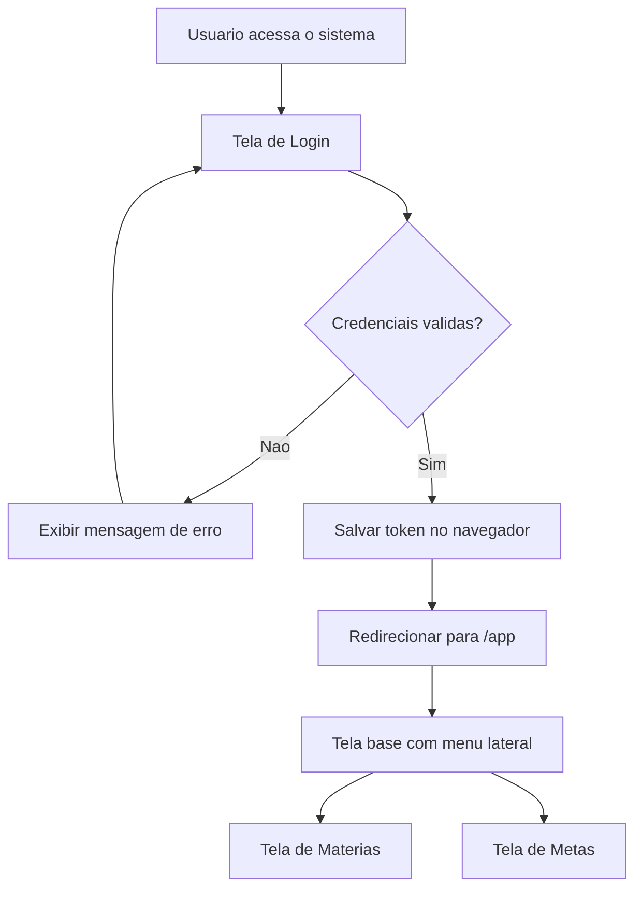
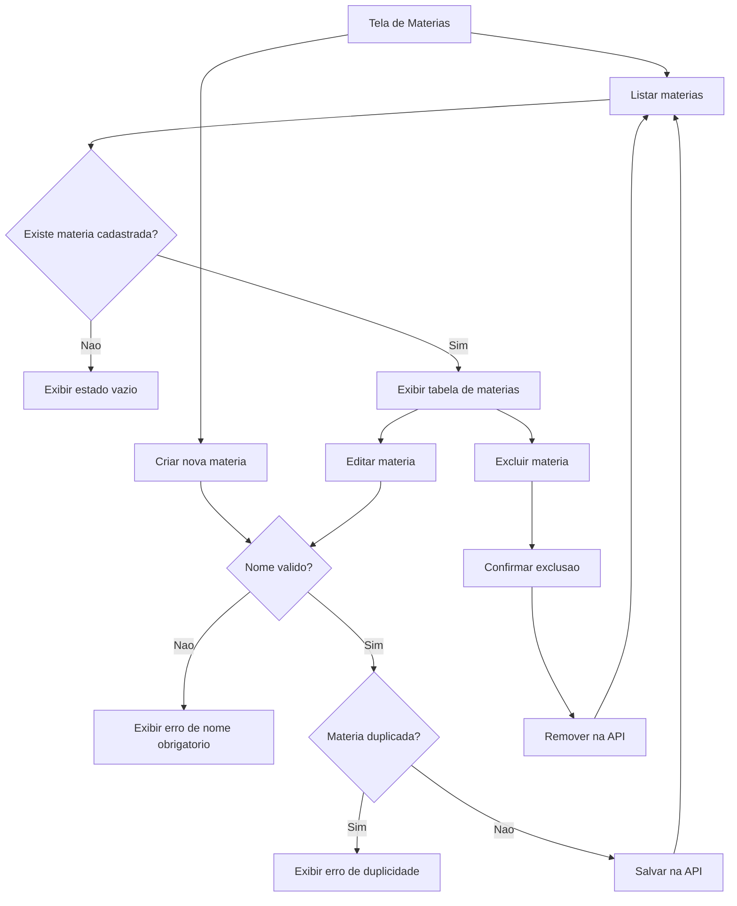
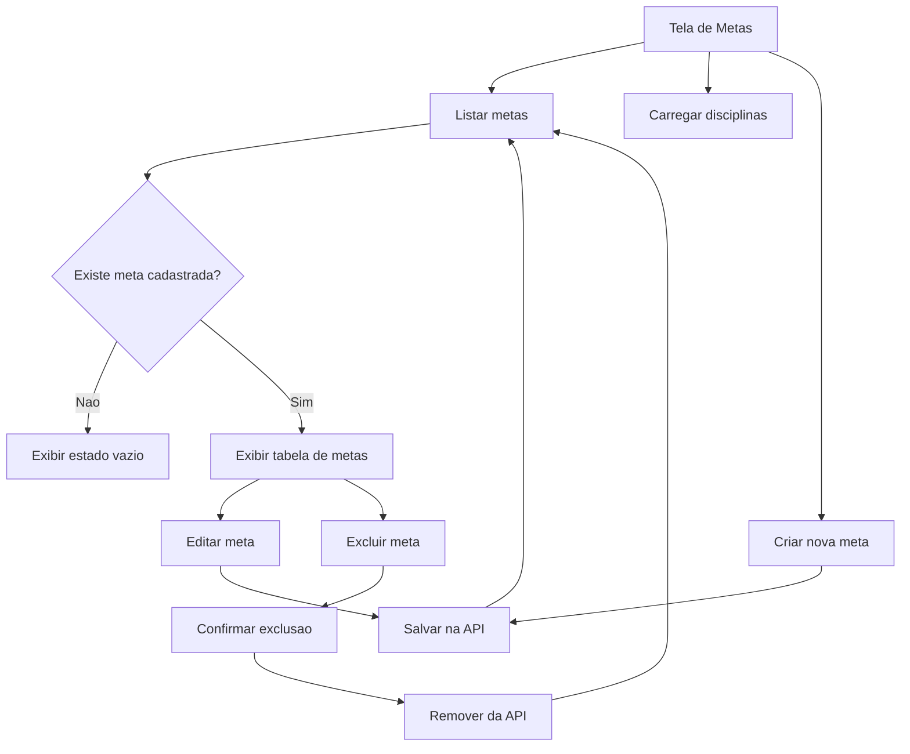
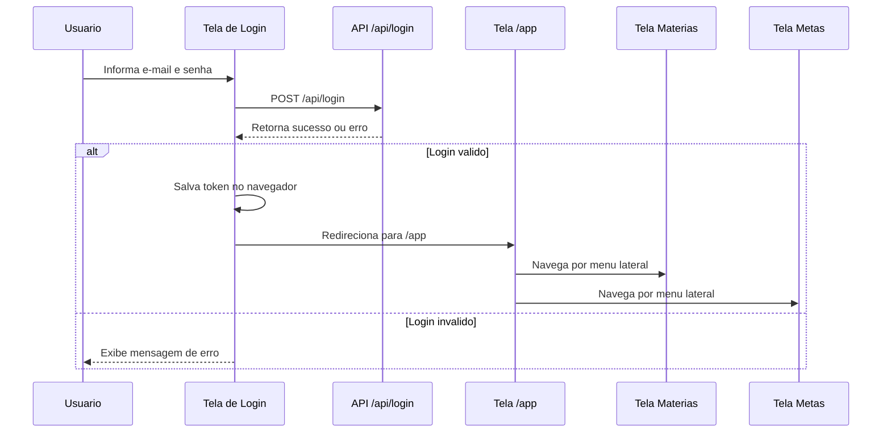
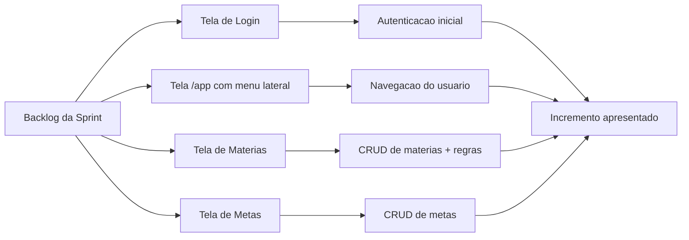

# Diagramas - Telas para Usuario Final

## Diagrama 1 - Fluxo principal do usuario

## Diagrama 2 - Fluxo da tela de materias

## Diagrama 3 - Fluxo da tela de metas

## Diagrama 4 - Sequencia da autenticacao e navegacao

## Diagrama 5 - Visao Scrum da entrega

## Como usar na apresentacao

1. Mostrar primeiro o fluxo principal
2. Abrir a tela de login
3. Demonstrar redirecionamento para `/app`
4. Mostrar o menu lateral e navegar para Materias
5. Demonstrar regras de negocio de Materias
6. Navegar para Metas e mostrar CRUD
7. Fechar com a visao Scrum da entrega
