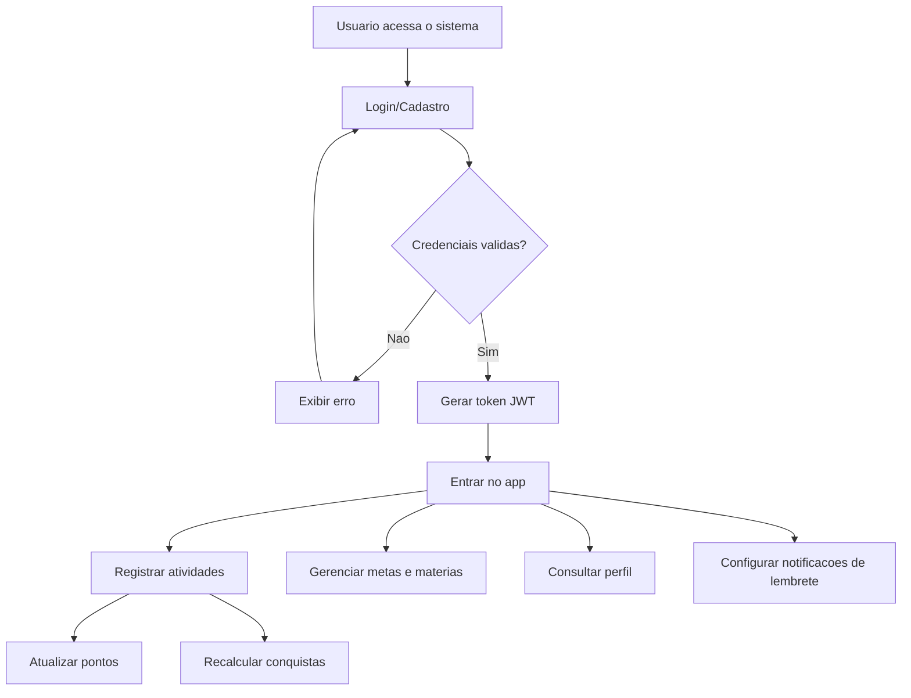
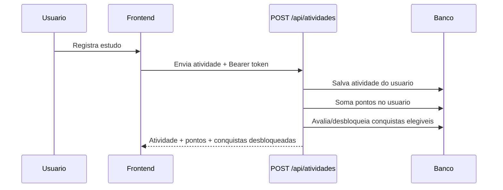
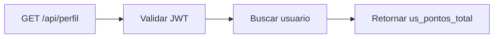
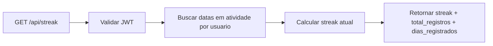

# Diagramas - Estado Atual

## Diagrama 1 - Fluxo principal autenticado

## Diagrama 2 - Sequencia do registro de estudo

## Diagrama 3 - Consulta de perfil

## Diagrama 4 - Consulta de streak (estado atual da resposta)

