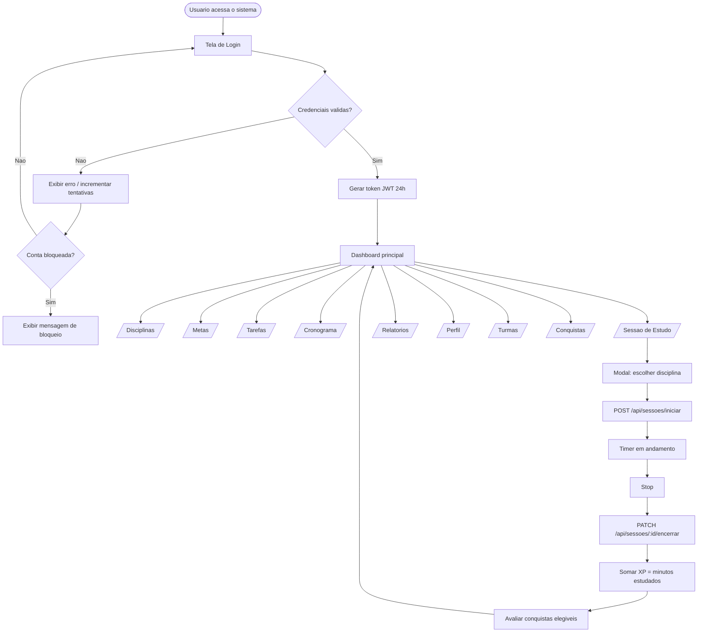
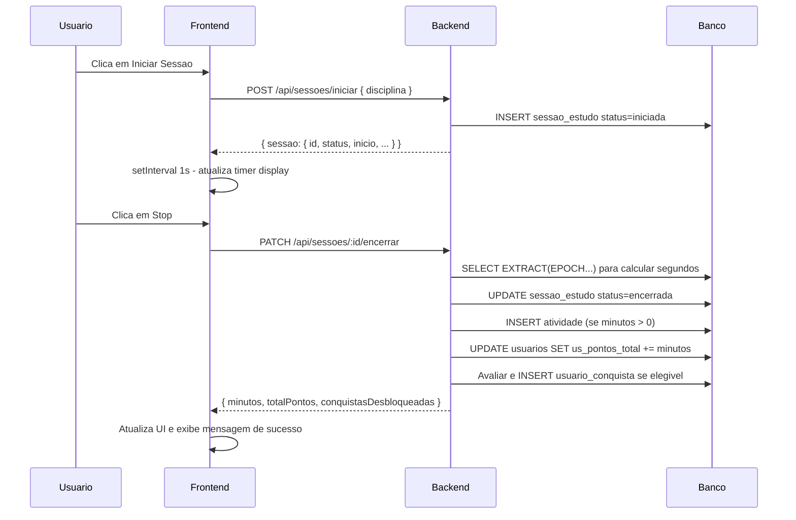
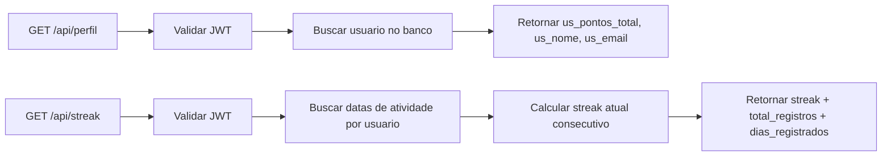

# Diagramas - Estado Atual do Sistema

Data de referencia: 2026-06-18

Os arquivos fonte Mermaid estao em `docs/mermaid/`.

---

## Diagrama 1 - Fluxo principal de autenticacao e navegacao

Arquivo: `docs/mermaid/Fluxograma N1.mmd`

---

## Diagrama 2 - Fluxo da sessao de estudo (detalhe tecnico)

Arquivo: `docs/mermaid/Fluxograma N2.mmd`

Detalha a comunicacao entre frontend (`estudos.html` + `estudos.js`), backend (routes/sessoes.js) e banco de dados durante uma sessao completa de estudo.

Pontos principais:
- O frontend verifica sessao ativa ao carregar a pagina
- Se ha sessao ativa, o timer e retomado de onde parou (`se_segundos_focados + elapsed`)
- Ao encerrar: calcula minutos, cria atividade, soma XP, avalia conquistas

---

## Diagrama 3 - Diagrama de Entidade-Relacionamento

Arquivo: `docs/mermaid/DER.mmd`

O banco possui 13 tabelas. Principais relacoes:

- `USUARIOS` e o centro — todas as outras tabelas referenciam `us_id`
- `DISCIPLINA` e de propriedade do usuario que a criou (`di_usuario_id`)
- `SESSAO_ESTUDO` encerrada gera automaticamente um registro em `ATIVIDADE`
- `ATIVIDADE` dispara avaliacao de conquistas em `USUARIO_CONQUISTA`
- `TAREFA` tem auditoria completa em `TAREFA_HISTORICO`
- `TURMA` vincula professor (criador) a alunos via `TURMA_ALUNO`

---

## Diagrama 4 - Diagrama de Classes

Arquivo: `docs/mermaid/Diagrama de Classe.mmd`

Representa as 13 entidades de dominio mais 2 servicos:

- `ConquistasService`: avalia e desbloqueia conquistas por criterio (tempo total, streak, metas)
- `NotificacoesService`: envia lembretes por email conforme configuracao do usuario

---

## Diagrama 5 - Diagrama de Casos de Uso

Arquivo: `docs/mermaid/Diagrama de caso de Uso.mmd`

Tres atores: **Aluno**, **Professor**, **Administrador**.

| Ator       | Funcionalidades exclusivas                                  |
|------------|-------------------------------------------------------------|
| Aluno      | Cadastro, entrar em turma via codigo                        |
| Professor  | Criar turma, gerenciar alunos, ver codigos de acesso        |
| Admin      | Acesso irrestrito a todas as turmas                         |
| Todos      | Login, disciplinas, relatorios, conquistas, perfil, XP      |

---

## Diagrama 6 - Sequencia do registro de estudo (via sessao)

---

## Diagrama 7 - Consulta de perfil e streak

