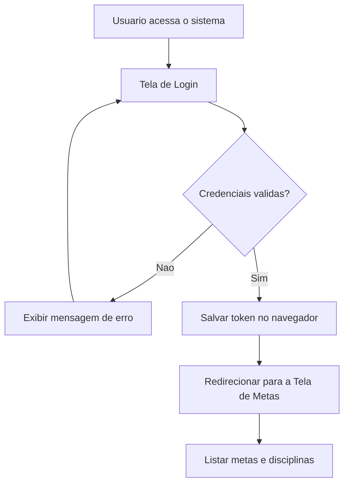
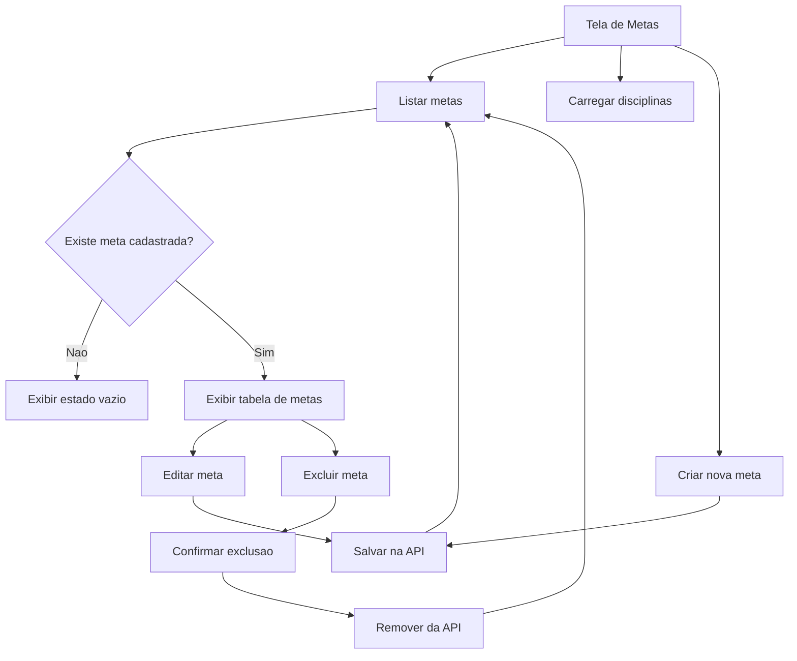
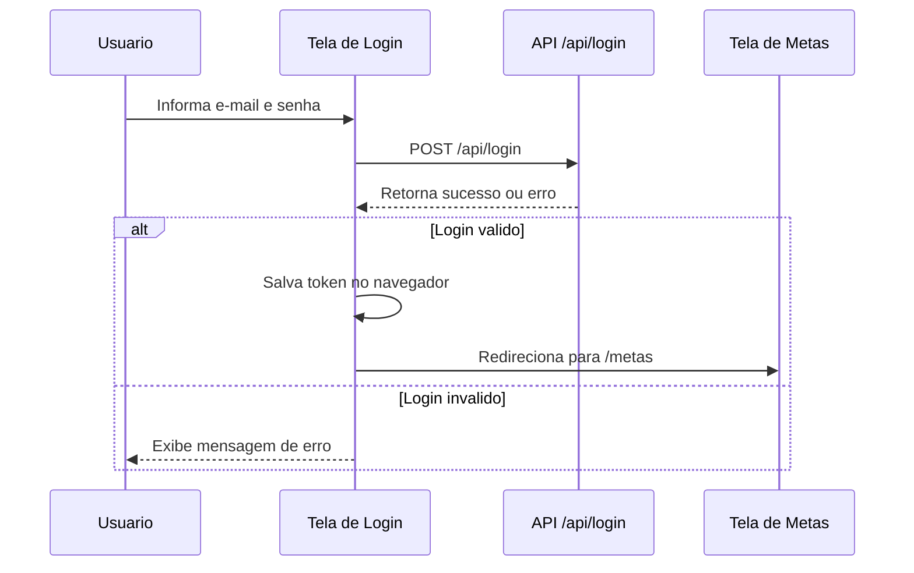
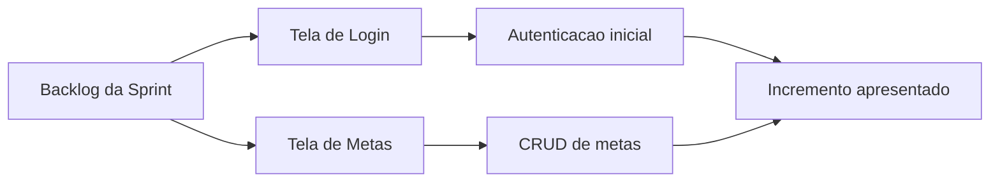

# Diagramas - Telas para Usuario Final

## Diagrama 1 - Fluxo principal do usuario

## Diagrama 2 - Fluxo da tela de metas

## Diagrama 3 - Sequencia da autenticacao

## Diagrama 4 - Visao Scrum da entrega

## Como usar na apresentacao

1. Mostrar primeiro o diagrama de fluxo principal
2. Em seguida abrir a tela de login
3. Depois mostrar a tela de metas
4. Fechar com o diagrama Scrum para explicar o incremento da Sprint
