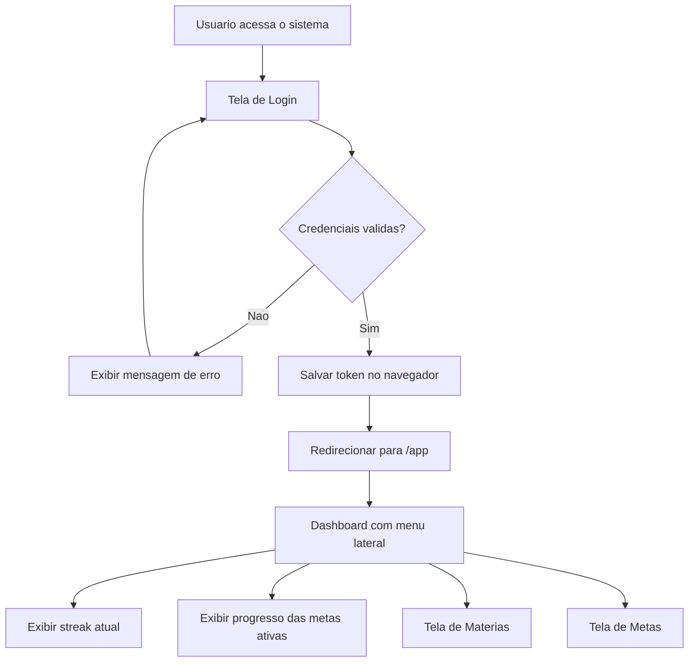
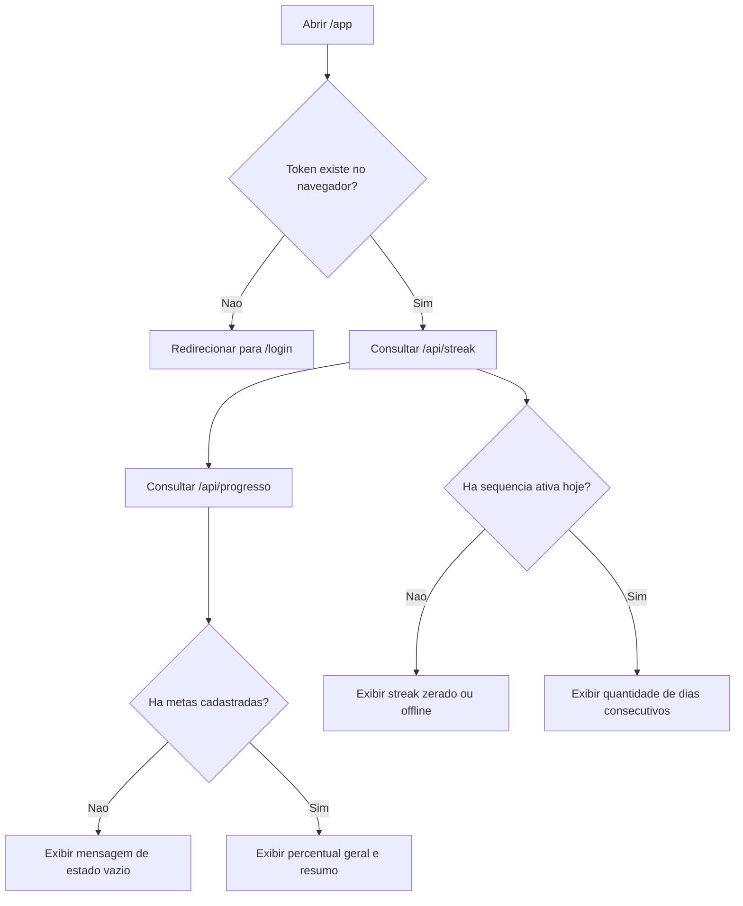
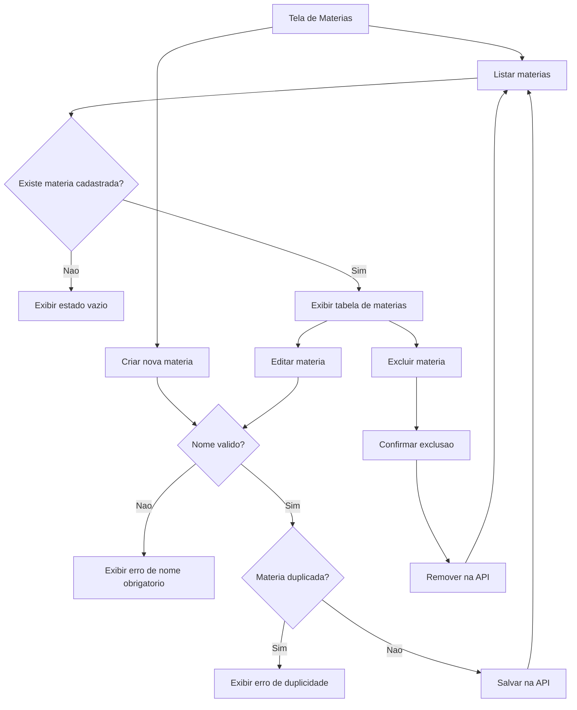
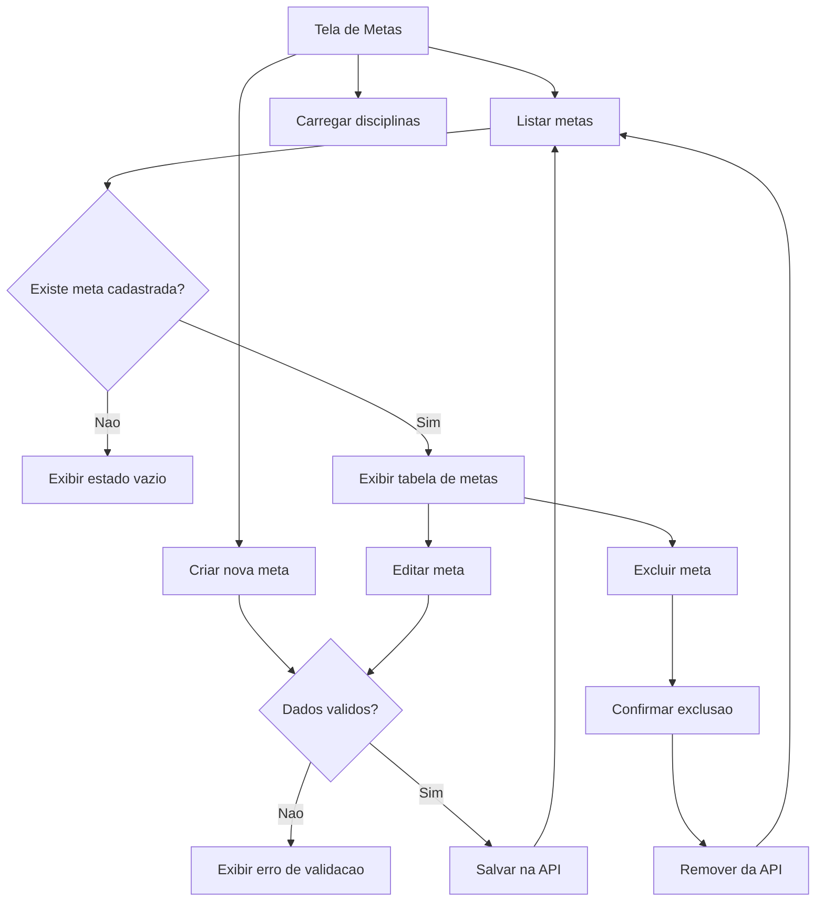
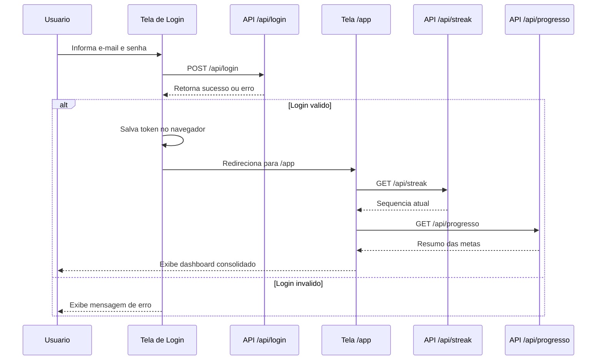
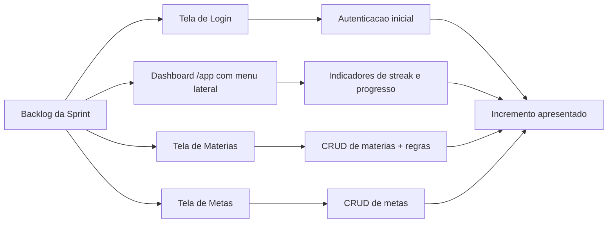

# Diagramas - Telas para Usuario Final

## Diagrama 1 - Fluxo principal do usuario

## Diagrama 2 - Fluxo do dashboard (/app)

## Diagrama 3 - Fluxo da tela de materias

## Diagrama 4 - Fluxo da tela de metas

## Diagrama 5 - Sequencia da autenticacao e carregamento do painel

## Diagrama 6 - Visao Scrum da entrega

## Como usar na apresentacao

1. Mostrar primeiro o fluxo principal
2. Abrir a tela de login
3. Demonstrar redirecionamento para `/app`
4. Mostrar o dashboard com streak e progresso
5. Navegar para `Materias` e demonstrar as regras de negocio
6. Navegar para `Metas` e mostrar CRUD
7. Fechar com a visao Scrum da entrega
